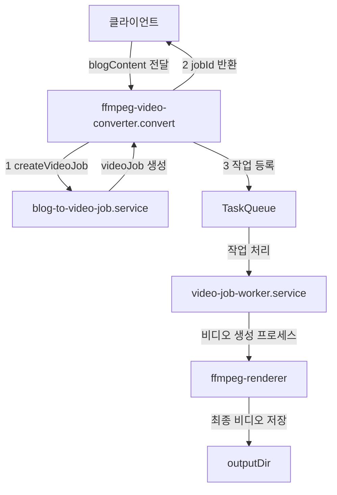
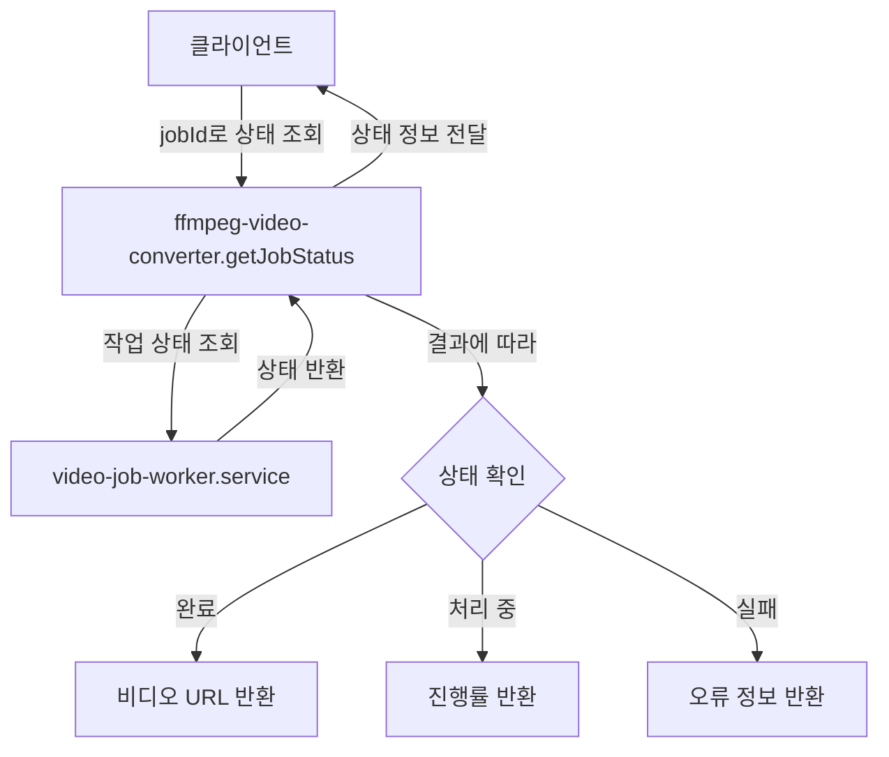
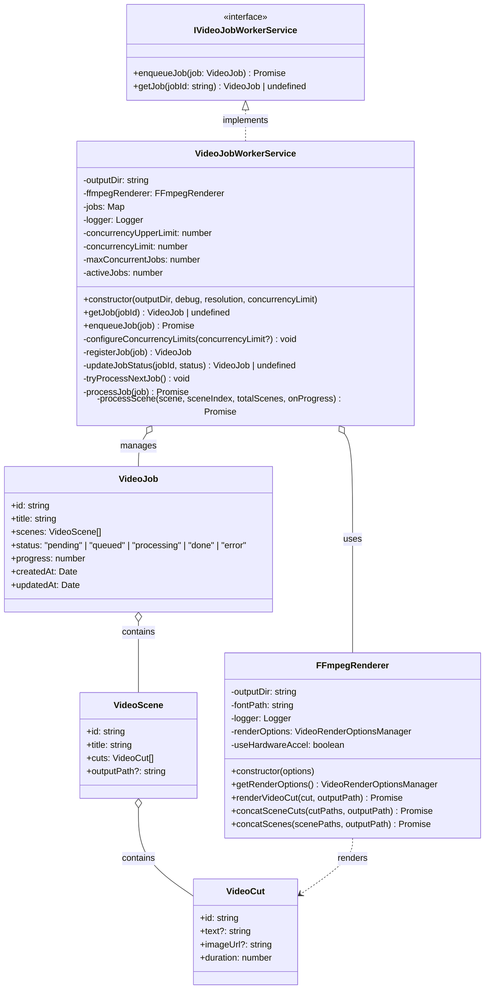

# video-converter

## 개요

블로그 콘텐츠를 비디오로 변환하는 서버 기반 모듈입니다. FFmpeg를 활용하여 비디오 처리 및 렌더링을 수행하며, 블로그 콘텐츠를 구조화된 비디오 장면과 컷으로 변환합니다.

## 구조

```
src/server/video-converter/
├── index.ts # 모듈 진입점
├── ffmpeg-video-converter.ts # 메인 비디오 변환기 구현
├── model/
│ ├── video-scene.model.ts # 비디오 장면 데이터 모델
│ └── video-cut.model.ts # 비디오 컷 데이터 모델
├── service/
│ ├── blog-to-video-job.service.ts # 블로그를 비디오로 변환하는 작업 관리
│ └── video-job-worker.service.ts # 비디오 변환 작업 처리 워커
└── ffmpeg/
├── command/
│ └── ffmpeg-command-builder.ts # FFmpeg 명령어 구성 빌더
├── options/
│ └── video-render-options-manager.ts # 비디오 렌더링 옵션 관리자
└── ffmpeg-renderer.ts # FFmpeg 기반 렌더링 엔진
```

## 동작 플로우

### 1. 비디오 생성 요청



1. 클라이언트가 `ffmpeg-video-converter.convert` 메소드로 블로그 콘텐츠를 전달합니다.
2. 변환기는 `blog-to-video-job.service.createVideoJob`을 호출하여 작업 객체를 생성합니다.
3. 생성된 작업 ID를 클라이언트에 반환합니다.
4. 변환기는 생성된 작업을 `TaskQueue`에 추가하고 처리를 시작합니다.
5. `video-job-worker.service`가 작업을 처리합니다:
   - 장면(Scene)과 컷(Cut)을 병렬로 처리(제한된 동시성 적용)
   - 각 장면과 컷을 렌더링하고 합치는 작업 수행
6. `ffmpeg-renderer`는 FFmpeg를 사용하여 비디오를 렌더링합니다.
7. 최종 비디오는 지정된 출력 디렉토리에 저장됩니다.

### 2. 비디오 생성 상태 조회



1. 클라이언트가 이전에 받은 작업 ID를 사용하여 `ffmpeg-video-converter.getJobStatus`에 상태 조회를 요청합니다.
2. 변환기는 `video-job-worker.service`를 통해 작업 상태를 조회합니다.
3. 작업 상태에 따라 다음 정보가 반환됩니다:
   - 완료: 생성된 비디오의 URL
   - 처리 중: 현재 진행률(%)
   - 실패: 오류 정보와 원인
4. 상태 정보가 클라이언트에 반환됩니다.

## video-job-worker 클래스 다이어그램



VideoJobWorkerService 클래스는 비디오 변환 작업의 핵심 처리 로직을 담당합니다:

- **작업 관리**: 모든 변환 작업을 등록하고 상태를 추적합니다.
- **동시성 처리**: 시스템 자원을 고려하여 적절한 수의 작업을 동시에 처리합니다.
- **장면 및 컷 처리**: 장면과 컷을 병렬로 처리하여 변환 속도를 최적화합니다.
- **진행률 관리**: 각 작업의 진행 상태를 실시간으로 업데이트합니다.
- **FFmpeg 통합**: FFmpegRenderer를 사용하여 실제 비디오 렌더링을 수행합니다.

핵심 프로세스 흐름:

1. enqueueJob: 새 작업을 등록하고 처리 큐에 추가
2. tryProcessNextJob: 동시성 제한을 고려하여 다음 작업 처리 여부 결정
3. processJob: 실제 작업 처리 로직 실행
4. processScene: 개별 장면 처리 (병렬 처리)
5. FFmpegRenderer 활용: 컷 렌더링 및 최종 비디오 합성
